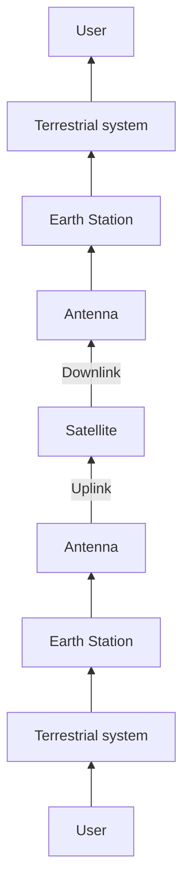

# Satellite flash card

## Definitions

`Satellite:` Any natural or artificial body moving around a celestial body such as planets or stars.

`Orbit:` A trajectory which is periodically repeated.

`Newton's Law of Gravitaion:` 

$$
F = \frac{G m_1 m_2}{r^2}
$$

`Kepler's First Law:` The path followed by a satellite around primary will be an ellipse. 

$$
e = \frac{\sqrt{a^2 - b^2}}{a}
$$

`Eccentricity:` Defines how **elongated** an ellipse. The formula is as seen above. As well as the velocity of the satellite in an elliptical orbit.

`Kepler's Second Law:` For equal time interval, a satellite will sweep out equal areas in its orbital plane. 

$$
\frac{dA}{dT} = \frac{Angular\ momentum\ of\ the satellite}{2m}
\\ where \ m\ -> mass\ of \ the\ satellite
$$

`Kepler's Third Law:` Square of the periodic time of the orbit is proportional to the cube of the mean distance between the two bodies.

$$
T = \frac {2 \pi a^{3/2}}{\sqrt {\mu}}
$$

## Orbital Parameters

`Apogee:` This is a point on the orbit of the satellite where in it lies the **farthest** from the **center of the earth.**

`Perigee:` A point on the satellite orbit wherein it lies **nearest** to the **center of the earth**.

`Line of apsides:` The line joining the **perigee** and **apogee** through the **center of the earth.**

`Ascending Node:` The point where the satellite orbit crosses the equatorial plane of the earth from **South** to **North**.

`Descending Node:` The point where the orbit crosses the equatorial plane of the earth from **North** to **South**.

`Inclination:` Angle between the **orbital plane** and the earth’s **equatorial plane**.

`Line of Nodes:` Line joining the **ascending** and **descending** node, through the **center of the earth**.

`Prograde Orbit:` Satellite moves in the **same** direction as the **rotation** of the earth.

`Retrograde Orbit:` Satellite moves in the **counter** direction as the **rotation** of the earth.

`Argument of Perigee:` Angle from the point of **perigee** measure in the **orbital plane** at the Earth’s center.

`Mean anomaloy:` Average value to the **angular** position of the satellite with reference to the **perigee**.

`True anamoly:` **Perigee** to the satellite’s position.

`Right Ascension of Ascending Node:` Angle made by the line of **nodes** with respect to the direction of the **venal equinox**.

## Effects of Non-Spherical Earth

Due to the shape of the earth, it causes some variations in the path followed by the satellite. As Earth is bulging at the equatorial belt onwards. This leads to the **regression** of nodes and the latitude of the point of perigee. This leads to the rotation of the line of **apsides**. These changes are observed  in the values of argument of perigee and right ascension of ascending node.

Also due to the bulge of the earth, this leads to a decrease in eccentricity, which leads to a decrease in gravitational pull of the satellite, which makes them drift to one of the two stable points which coincide with minor axis of equatorial plane. This is known as **Satellite graveyard**.

## Types of Satellite orbits

### 1. Orientation of orbital plane

- `Equatorial orbit:` Inclination angle = 0
- `Polar Orbit:` Inclination angle = 90
- `Prograde Orbit:` Inclination angle from **0** to **90**
- `Retrograde Orbit:` Inclination angle from **90** to **180**

### 2. Eccentricity

- `Circular Orbit`
- `Elliptical Orbit`

### 3. Distance from earth

- `Geosynchronous Earth Orbit (GEO):` The orbit of the satellite is synchronized with the rotation of the earth, and the orbit is **tilted** w.r.t the plane of equator. It remains on the same latitude. The orbit of these satellites is **circular**.
- **Conditions**
    - 36k km above the surface of the earth.
    - Satellite must travel in the **rotational speed of earth** and in direction of the earth (eastward).
    - Inclination w.r.t earth = 0
    
- `Medium Earth Orbit (MEO):` The orbit is positioned between LEO and GEO. Around **20k km from the surface of the earth.** Satellites move more slowly relative to the earth’s rotation.
- `Low Earth Orbit (LEO):` Satellites are placed **500 - 1500 km** above the surface of the earth. High elevation for every spot, and high quality communication link Transmission rates of 2400 bits/s. The delays is around 10 ms. They are used in remote sensing, and mobile communication services.

## Eclipse

**Earth’s equatorial plane** coincides with the plane of the **Earth’s orbit** around the sun. The eclipses begin 23 days before equinox and end 23 days after. They range around 10 - 72 mins from the starting to the ending of the equinox.

In the east, the eclipse will happen during late evening local time. And in the west early morning local time.

## Satellite Communication  
Communication done using a communication satellite in which an aritifical satellite receives a communications signal from a transmitting ground station, amplifies and possible processes it, then transmits it back to the earth fro reception by on or more receiving ground stations.

